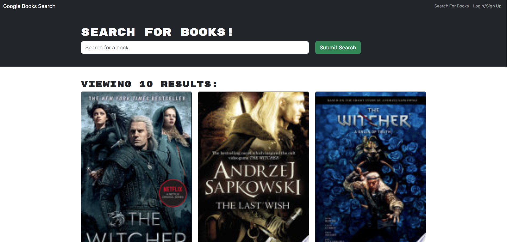

# 21 MERN: Book Search Engine

## Description
This site allows you to search for books, you can log in or create and account, once logged in books you search can be added to a list you make to use as referance for books to buy in the future!

## User Story

```md
AS AN avid reader
I WANT to search for new books to read
SO THAT I can keep a list of books to purchase
```

## Usage
- run npm run install
- run npm run build
- run npm run start
- server should be up in running just use the assocaited port to get to it as show in the terminal

## Screenshot


## Links
[Repository](https://github.com/Zorzorac05/book-search-engine)
[My Github](https://github.com/Zorzorac05)